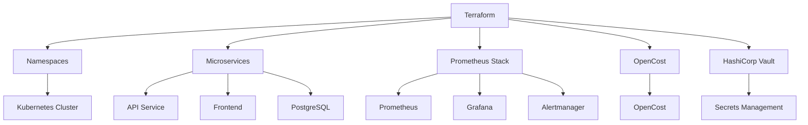

# Terraform Kubernetes Platform

Production-oriented Kubernetes infrastructure provisioned entirely 
through Terraform.

This project demonstrates Infrastructure as Code principles by 
managing Kubernetes resources, observability tooling, cost 
visibility, and secrets management through reusable Terraform 
modules. The entire platform can be reproduced from source control 
without manual resource creation or imperative kubectl apply 
workflows.

---

## Overview

Modern infrastructure should be declarative, reproducible, 
and auditable.

Rather than manually creating namespaces, deployments, services, 
and supporting platform components, this repository provisions an 
entire Kubernetes platform through Terraform.

Key objectives:

- Infrastructure managed as code
- Reproducible environments
- Version-controlled changes
- Automated resource provisioning
- Reduced configuration drift
- Centralized state management

---

## Architecture



---

## Problem Statement

Manual infrastructure management introduces operational risks:

- Configuration drift between environments
- Limited auditability of changes
- Difficult disaster recovery
- Inconsistent deployments
- Increased operational overhead

Infrastructure as Code addresses these challenges by ensuring every 
resource is defined declaratively and tracked through source control.

With Terraform:

- Every change is reviewed before deployment
- Every environment can be recreated consistently
- Infrastructure state is centrally managed
- Drift can be detected and corrected
- Platform provisioning becomes repeatable and predictable

---

## Architecture Components

| Component | Provisioning Method |
|-----------|-------------------|
| Kubernetes Namespaces | Terraform Kubernetes Provider |
| Microservice Deployments | Terraform Modules |
| Kubernetes Services | Terraform Modules |
| Prometheus Monitoring Stack | Helm via Terraform |
| OpenCost | Helm via Terraform |
| HashiCorp Vault | Helm via Terraform |
| Kubernetes Secrets | Terraform Resources |

---

## Namespaces

- microservices
- monitoring
- opencost
- vault

---

## Services Deployed

**Microservices**

| Service | Resources |
|---------|----------|
| API Service | Deployment, Service |
| Frontend | Deployment, Service |
| PostgreSQL | Deployment, Service, Secret |

**Observability**

Prometheus stack includes Prometheus, Grafana, Alertmanager, 
Prometheus Operator, and Node Exporters.

**Cost Visibility**

OpenCost provides namespace-level cost tracking, service-level 
cost allocation, and resource consumption insights.

**Secrets Management**

HashiCorp Vault provides dynamic credential generation, 
credential rotation, and centralized secret governance.

Note: Kubernetes Secrets are Base64 encoded, not encrypted by 
default. Vault eliminates long-lived credentials entirely.

---

## Project Structure

```
Terraform-Kubernetes-Platform/
├── main.tf
├── providers.tf
├── variables.tf
├── terraform.tfvars
└── modules/
    ├── namespaces/
    ├── microservices/
    ├── monitoring/
    ├── opencost/
    └── vault/
```

---

## Technical Decisions

**Why Terraform?**

Kubernetes resources, Helm charts, and supporting platform services 
can all be managed from a single declarative workflow with full 
state management and change planning.

**Why Helm Through Terraform?**

Unified infrastructure management with consistent deployment 
workflows, version-controlled chart upgrades, and centralized 
state tracking.

**Why Vault Over Kubernetes Secrets?**

Kubernetes Secrets are Base64 encoded, not encrypted at rest by 
default. Vault introduces dynamic credentials, secret leasing, 
and centralized secret governance.

**Why OpenCost?**

Resource usage alone does not provide visibility into platform 
costs. OpenCost enables namespace and service cost allocation 
with real-time consumption analysis.

---

## Terraform State

```
module.microservices.kubernetes_deployment.api_service
module.microservices.kubernetes_deployment.frontend
module.microservices.kubernetes_deployment.postgres
module.microservices.kubernetes_secret.postgres
module.microservices.kubernetes_service.api_service
module.microservices.kubernetes_service.frontend
module.monitoring.helm_release.prometheus
module.namespaces.kubernetes_namespace.microservices
module.namespaces.kubernetes_namespace.monitoring
module.namespaces.kubernetes_namespace.opencost
module.namespaces.kubernetes_namespace.vault
module.opencost.helm_release.opencost
module.vault.helm_release.vault
```

Total resources managed: **13**

---

## Prerequisites

- Terraform
- kubectl
- Helm
- Minikube or Kubernetes cluster

---

## Deployment

```bash
# Clone the repository
git clone https://github.com/velrite/Terraform-Kubernetes-Platform.git
cd Terraform-Kubernetes-Platform

# Initialize Terraform
terraform init

# Review the execution plan
terraform plan

# Provision all infrastructure
terraform apply
```

---

## Verification

```bash
# Verify namespaces
kubectl get namespaces

# Verify workloads
kubectl get pods --all-namespaces

# Verify Terraform-managed resources
terraform state list
```

---

## Results

Successful deployment provisions:

- 13 Terraform-managed resources
- 4 Kubernetes namespaces
- Prometheus monitoring stack with Grafana dashboards
- OpenCost cost visibility per namespace and service
- HashiCorp Vault secrets management
- Modular Terraform architecture reproducible from a single command

---

## Lessons Learned

- Helm chart dependencies must be managed carefully to avoid 
  failed releases
- Terraform state becomes a critical dependency and must 
  be protected
- Monitoring should be provisioned alongside workloads rather 
  than added later
- Secret management becomes increasingly important as 
  environments scale
- Modular Terraform design significantly improves 
  maintainability and reuse

---

## Future Improvements

- Remote Terraform state backend
- CI/CD pipeline integration
- Automated policy enforcement
- Multi-environment deployments
- GitOps integration with ArgoCD
- High availability Vault deployment

---

> Infrastructure should be reproducible by definition — not by effort.

---

## Author

Olamide Olalekan — Platform & DevSecOps Engineer

[LinkedIn](https://linkedin.com/in/olamide-olalekan-12138a265) |
[GitHub](https://github.com/velrite)

## Related Projects

- [Auto-Healing Kubernetes Platform](https://github.com/velrite/auto-healing-kubernetes-platform)
- [Dockerize-Everything](https://github.com/velrite/Dockerize-Everything)
```

---
